# 🎬 MiniNetflix — Complete Architecture Design

A production-grade serverless video processing pipeline inspired by Netflix's architecture, built with **Spring Boot 3.2**, **React 18**, and **AWS managed services**.

---

## 1. High-Level System Architecture

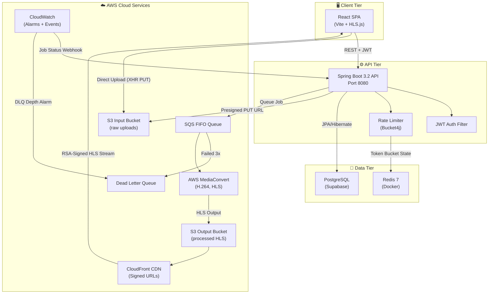

---

## 2. Technology Stack

### Backend
| Category | Technology | Version | Purpose |
|----------|-----------|---------|---------|
| Framework | Spring Boot | 3.2.0 | REST API, DI, auto-config |
| Language | Java | 17 | LTS, records, sealed classes |
| ORM | Spring Data JPA / Hibernate | — | Entity mapping, repositories |
| Security | Spring Security + JJWT | 0.12.3 | JWT auth, BCrypt, filter chain |
| Rate Limiting | Bucket4j + Redis | 8.7.0 | Token bucket, distributed state |
| AWS SDK | AWS SDK v2 | 2.25.27 | S3, SQS, MediaConvert, CloudFront |
| Database | PostgreSQL (Supabase) | 15 | Persistent storage |
| Cache | Redis | 7 (Alpine) | Rate limit state, session cache |
| Monitoring | Spring Actuator + Prometheus | — | Health checks, metrics |
| Build | Maven | 3.9+ | Dependency management |

### Frontend
| Category | Technology | Version | Purpose |
|----------|-----------|---------|---------|
| Framework | React | 18.2 | Component-based UI |
| Build Tool | Vite | 5.0 | Fast HMR dev server, bundler |
| Routing | React Router DOM | 6.20 | SPA client-side routing |
| HTTP Client | Axios | 1.6 | API calls with interceptors |
| Video Player | HLS.js | 1.4.14 | Adaptive bitrate streaming |
| File Upload | react-dropzone | 14.2 | Drag & drop file selection |
| Notifications | react-hot-toast | 2.4 | Toast notifications |
| Icons | lucide-react | 0.294 | SVG icon components |

### Infrastructure
| Service | Purpose | Config |
|---------|---------|--------|
| S3 Input Bucket | Raw video uploads | 7-day lifecycle expiry |
| S3 Output Bucket | Processed HLS output | 30-day → Glacier transition |
| SQS FIFO Queue | Decouple upload from processing | Content-based dedup, 5-min visibility |
| SQS DLQ | Capture failed jobs | 14-day retention, max 3 retries |
| AWS MediaConvert | Professional transcoding | H.264, multi-resolution HLS |
| CloudFront | Global CDN delivery | Signed URLs, cache-optimized |
| CloudWatch | Observability | DLQ depth alarms, job events |
| IAM | Least privilege access | Scoped MediaConvert role |

---

## 3. Backend Architecture (Layered)

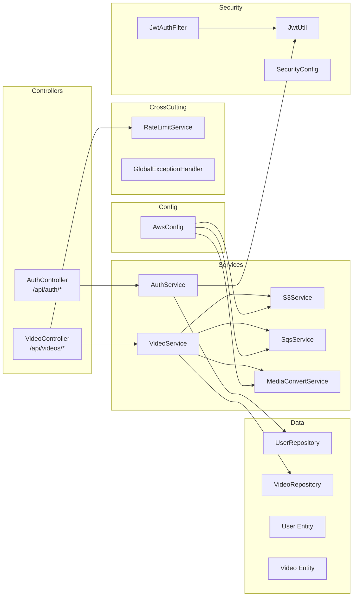

### Package Structure

```
com.mininetflix/
├── VideoStreamingApplication.java    # @SpringBootApplication entry point
├── config/
│   ├── AwsConfig.java                # AWS client beans (S3, SQS, MediaConvert, Presigner)
│   └── SecurityConfig.java           # Security filter chain, CORS, BCrypt, AuthManager
├── controller/
│   ├── AuthController.java           # POST /register, /login
│   └── VideoController.java          # CRUD videos, upload-url, confirm, stream, webhook
├── dto/
│   ├── AuthDto.java                  # RegisterRequest, LoginRequest, AuthResponse
│   ├── VideoDto.java                 # UploadUrlRequest/Response, VideoResponse, ConfirmRequest
│   └── RateLimitDto.java             # Rate limit status DTO
├── exception/
│   └── GlobalExceptionHandler.java   # @RestControllerAdvice (validation, rate-limit, general)
├── model/
│   ├── User.java                     # JPA entity + UserDetails (UUID, email, tier, BCrypt pwd)
│   └── Video.java                    # JPA entity (UUID, status FSM, S3 keys, job tracking)
├── ratelimit/
│   └── RateLimitService.java         # Tier-based upload + file size limits
├── repository/
│   ├── UserRepository.java           # findByEmail, findByUsername, existsBy*
│   └── VideoRepository.java          # countTodayUploads, findByStatus, findByJobId
├── security/
│   ├── JwtAuthFilter.java            # OncePerRequestFilter — extracts/validates Bearer token
│   └── JwtUtil.java                  # HMAC-SHA256 JWT generation, validation, claims extraction
└── service/
    ├── AuthService.java              # Register (BCrypt + JWT), Login (AuthManager + JWT)
    ├── VideoService.java             # Core orchestrator — upload, confirm, stream, status, poll
    ├── S3Service.java                # Presigned URLs, CloudFront signed URLs, object management
    ├── SqsService.java               # Queue video processing jobs to FIFO queue
    └── MediaConvertService.java      # Create transcoding jobs, adaptive bitrate output groups
```

---

## 4. Data Models

### User Entity

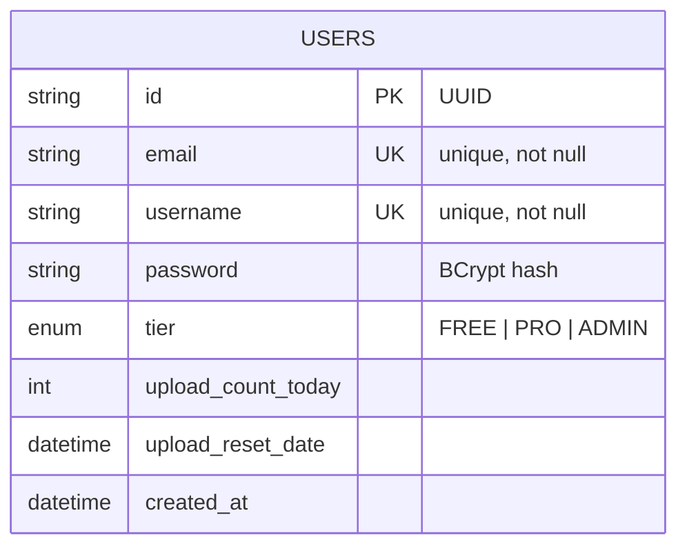

### Video Entity (with State Machine)

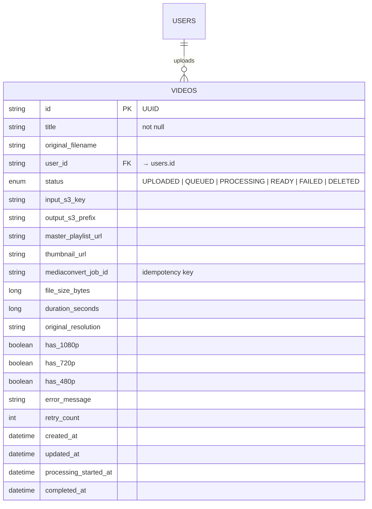

### Video Status State Machine

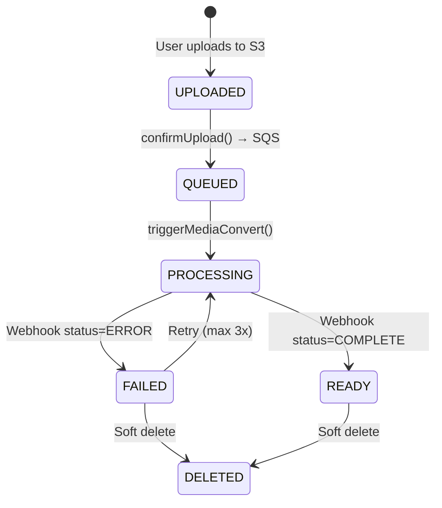

---

## 5. Core Data Flows

### 5.1 — User Registration / Login

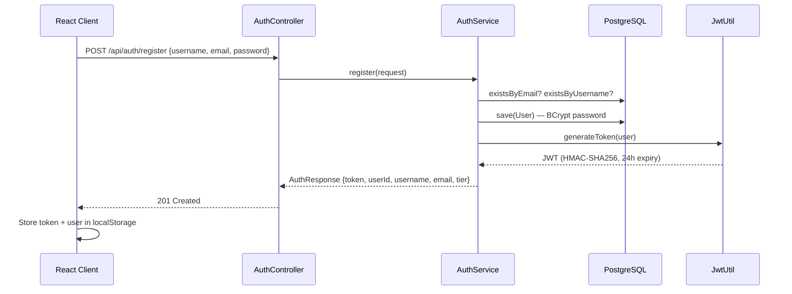

### 5.2 — Video Upload Pipeline (Core Flow)

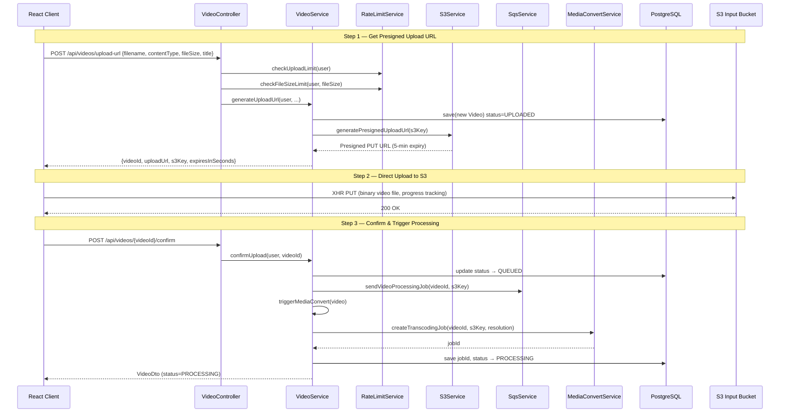

### 5.3 — Video Processing & Completion

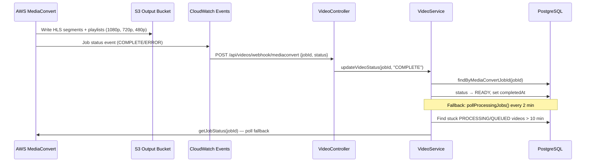

### 5.4 — Video Streaming (Signed URL Flow)

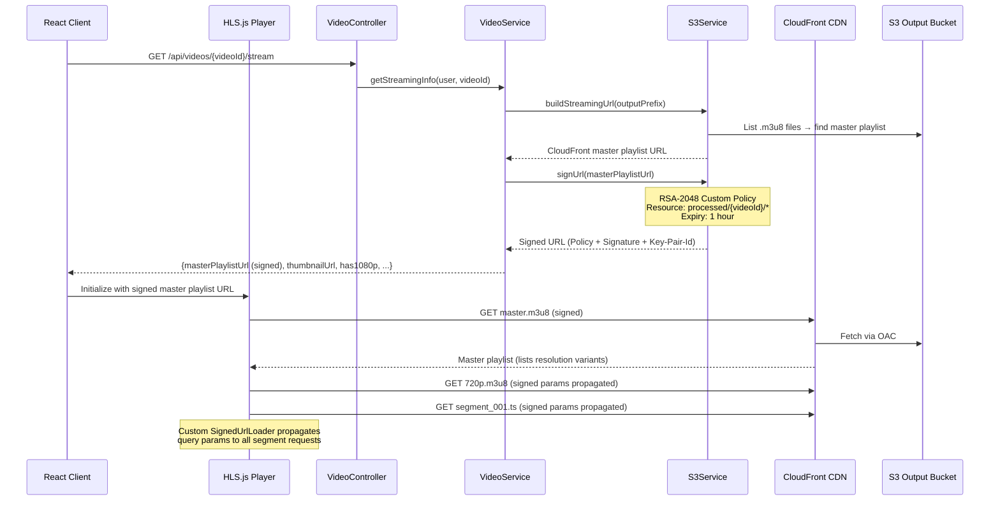

---

## 6. Security Architecture

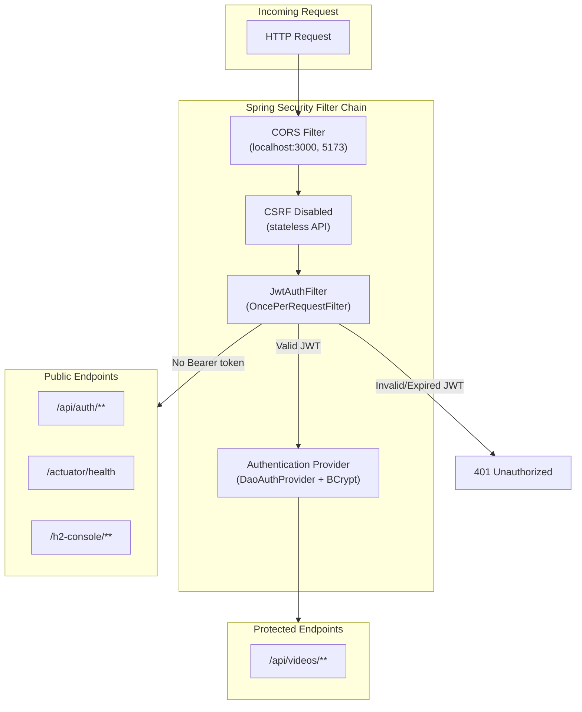

### Security Measures

| Layer | Mechanism | Details |
|-------|-----------|---------|
| **Authentication** | JWT (HMAC-SHA256) | 24-hour expiry, username in subject claim |
| **Password Storage** | BCrypt | Salted hashing via Spring Security |
| **Upload Security** | Presigned URLs | 5-min expiry, scoped to specific S3 key |
| **Streaming Security** | CloudFront Signed URLs | RSA-2048, custom policy with wildcard resource, 1-hour expiry |
| **File Validation** | Content-type check | Only `video/*` MIME types accepted |
| **API Security** | Stateless sessions | No server-side sessions, pure JWT |
| **CORS** | Whitelist origins | Configurable via `CORS_ORIGINS` env var |
| **IAM** | Least privilege | MediaConvert role scoped to specific S3 buckets |
| **Docker** | Non-root user | Backend runs as non-root in container |

---

## 7. Rate Limiting Architecture

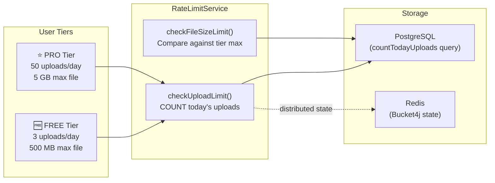

---

## 8. Frontend Architecture

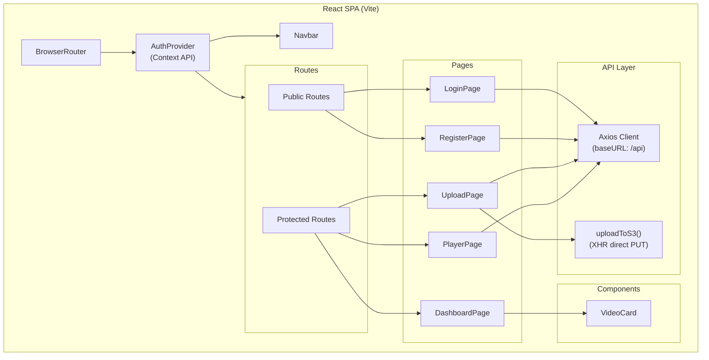

### Frontend Route Map

| Route | Component | Guard | Purpose |
|-------|-----------|-------|---------|
| `/` | — | Redirect | → `/dashboard` or `/login` |
| `/login` | `LoginPage` | Public | Email + password login |
| `/register` | `RegisterPage` | Public | Username + email + password |
| `/dashboard` | `DashboardPage` | Protected | Video grid, rate limit status, refresh |
| `/upload` | `UploadPage` | Protected | Drag & drop, 3-step progress, S3 direct upload |
| `/watch/:videoId` | `PlayerPage` | Protected | HLS.js adaptive player, signed URL loader |

### Key Frontend Patterns

- **Auth Context** — `AuthProvider` wraps entire app, stores JWT in `localStorage`, auto-restores session
- **Axios Interceptors** — Auto-attach `Bearer` token on every request; auto-redirect to `/login` on 401
- **Direct S3 Upload** — `uploadToS3()` uses `XMLHttpRequest` (not Axios) for progress tracking via `xhr.upload.progress`
- **Signed URL Propagation** — Custom `SignedUrlLoader` for HLS.js that propagates CloudFront query params (`Policy`, `Signature`, `Key-Pair-Id`) from the master playlist URL to all segment requests

---

## 9. Infrastructure as Code (CloudFormation)

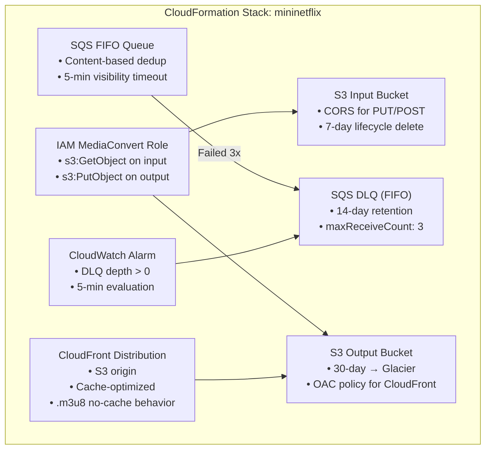

---

## 10. MediaConvert Encoding Strategy

| Output | Resolution | Bitrate | When Generated |
|--------|-----------|---------|----------------|
| 1080p | 1920×1080 | 5 Mbps | Input ≥ 1080p |
| 720p | 1280×720 | 2.5 Mbps | Input ≥ 720p |
| 480p | 854×480 | 1 Mbps | Always |

- **HLS segmentation**: 6-second chunks for fast startup
- **Audio**: AAC-LC, 96 kbps, 48 kHz sample rate
- **Smart encoding**: Only generates resolutions ≤ input resolution (cost optimization)
- **Output structure**: `processed/{videoId}/` — master playlist + per-resolution playlists + `.ts` segments

---

## 11. Fault Tolerance & Reliability

| Mechanism | Implementation | Purpose |
|-----------|---------------|---------|
| **SQS DLQ** | Failed jobs after 3 retries → DLQ | Prevent data loss |
| **Idempotent Job Creation** | Check `mediaConvertJobId` before creating | Prevent duplicate encoding |
| **Polling Fallback** | `@Scheduled` every 2 min for stuck jobs | Handle missed webhooks |
| **Soft Deletes** | `VideoStatus.DELETED` (never hard delete) | Data recovery |
| **Structured Error Handling** | `GlobalExceptionHandler` with typed responses | Consistent API errors |
| **CloudWatch Alarm** | DLQ depth ≥ 1 triggers alarm | Ops alerting |
| **Retry Tracking** | `retryCount` + `errorMessage` on `Video` entity | Debug failed jobs |

---

## 12. Observability

| Tool | Endpoint / Config | Metrics |
|------|-------------------|---------|
| Spring Actuator | `/actuator/health` | App health, DB, Redis |
| Prometheus | `/actuator/prometheus` | JVM, HTTP, custom metrics |
| Structured Logging | SLF4J + Logback | `com.mininetflix: DEBUG` |
| CloudWatch | Alarm on DLQ depth | Encoding failure detection |
| MediaConvert | Job progress API | Transcoding % complete |

---

## 13. Deployment Architecture

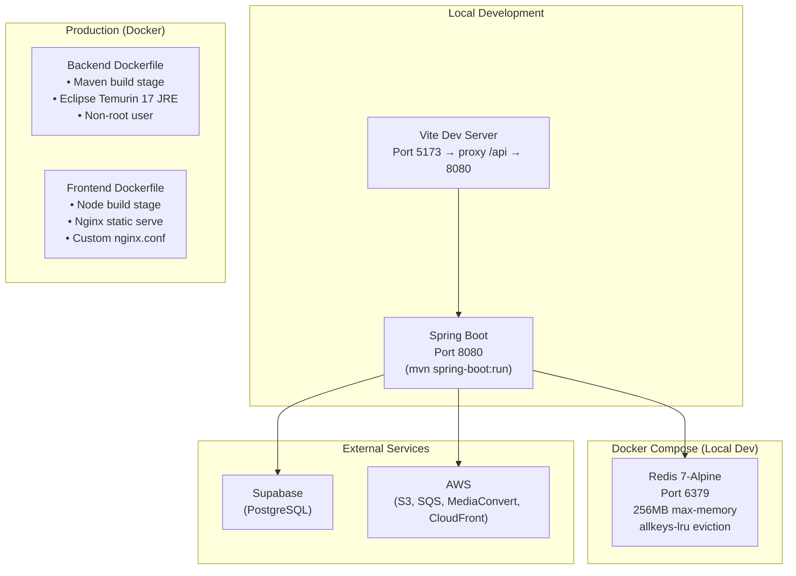

---

## 14. API Contract Summary

### Auth Endpoints (Public)

| Method | Endpoint | Request | Response |
|--------|----------|---------|----------|
| `POST` | `/api/auth/register` | `{username, email, password}` | `{token, userId, username, email, tier, message}` |
| `POST` | `/api/auth/login` | `{email, password}` | `{token, userId, username, email, tier, message}` |

### Video Endpoints (Authenticated)

| Method | Endpoint | Request | Response |
|--------|----------|---------|----------|
| `GET` | `/api/videos` | — | `[VideoDto]` |
| `GET` | `/api/videos/:id` | — | `VideoDto` |
| `POST` | `/api/videos/upload-url` | `{filename, contentType, fileSize, title}` | `{videoId, uploadUrl, s3Key, expiresInSeconds}` |
| `POST` | `/api/videos/:id/confirm` | `{fileSizeBytes?}` | `VideoDto` |
| `GET` | `/api/videos/:id/stream` | — | `{masterPlaylistUrl, thumbnailUrl, has1080p, ...}` |
| `DELETE` | `/api/videos/:id` | — | `204 No Content` |
| `GET` | `/api/videos/rate-limit` | — | `{uploadsToday, dailyLimit, remaining, tier}` |
| `POST` | `/api/videos/webhook/mediaconvert` | `{jobId, status, progress}` | `{received: true}` |

---

## 15. Key Design Decisions

| Decision | Rationale |
|----------|-----------|
| **Direct S3 upload** (presigned URLs) | Backend never handles video bytes → eliminates I/O bottleneck, scales horizontally |
| **SQS FIFO** between upload and processing | Decouples upload latency from encoding time; enables retry and ordering |
| **HLS over DASH** | Broader device support (iOS native), simpler CloudFront integration |
| **CloudFront Signed URLs** (custom policy) | Wildcard resource access (`processed/{videoId}/*`) lets one signature cover all segments |
| **PostgreSQL over DynamoDB** | Relational queries (countTodayUploads, complex joins) are natural in SQL |
| **Redis for rate limiting** | Distributed state for horizontal scaling; Bucket4j integration |
| **Soft deletes** | Never lose data; can audit and recover |
| **Polling fallback** for job status | CloudWatch webhooks can be missed; 2-min poll catches stuck jobs |
| **Smart encoding** (resolution-aware) | Don't waste money generating 1080p from a 480p source file |
| **6-second HLS segments** | Balance between startup latency and encoding overhead |
